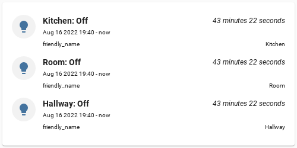

# logbook-card

## How to install

### Manually
1. Download [built module](dist/logbook-intervals.js) into `www` of your HomeAssistant configuration directory. 
2. Add `local/logbook-intervals.js` to Lovelace resources (type = `module`)

## Configuration
<details>
<summary>Hello</summary>



```yaml
type: 'custom:logbook-intervals-card'
entities: light.*
states:
  - value: o*
attributes:
  - name: friendly_name
  - name: supported_features
```
</details>
